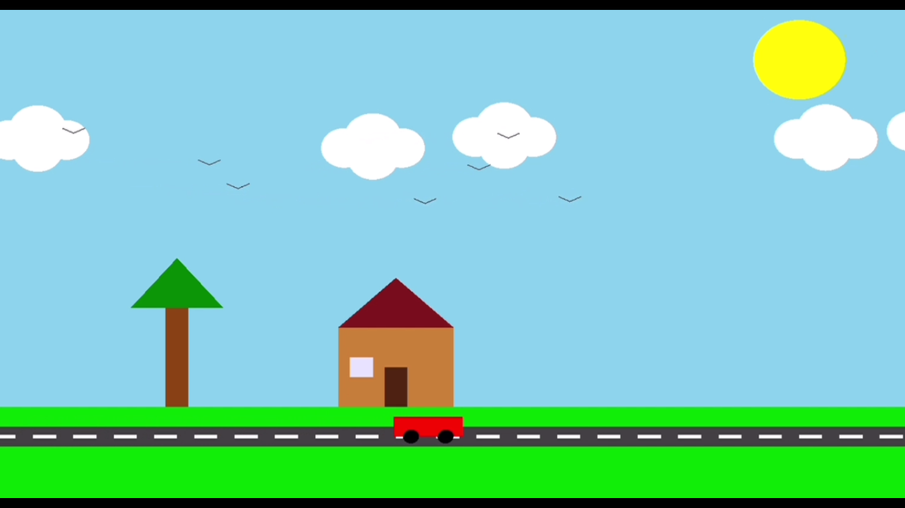
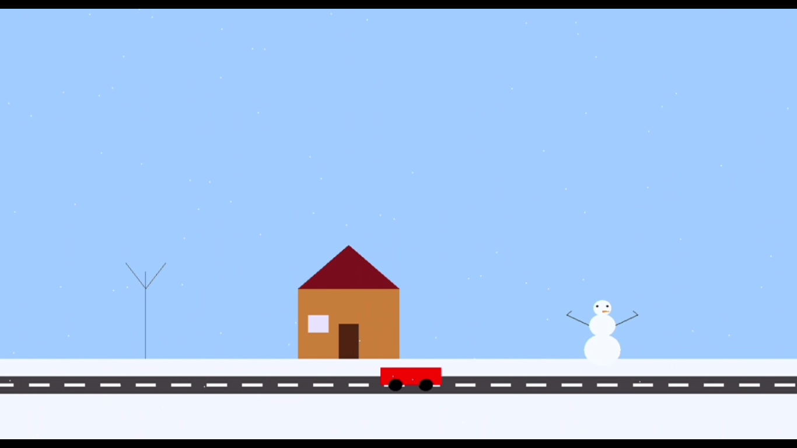

# Summer vs Winter Landscape (OpenGL Project)

This is a simple animated OpenGL graphics project that visualizes a landscape transitioning between summer and winter modes. The scene includes houses, roads, moving clouds, birds, cars, snow, and even a snowman — all rendered using basic OpenGL functions.

## Features

Summer scene with:
  - Bright sky and sun rays (animated)
  - Floating clouds and flying birds
  - Running car on the road

Winter scene with:
  - Light blue snowy sky
  - Falling snowflakes
  - Bare tree and snowman
  - Running car on the road (avoiding snowman)

Press T to toggle between Summer and Winter scenes  
Animated using GLUT timers

## Screenshots

### Summer View

### Winter View

## Demo Video

You can view a short video demo of both summer and winter views:

[Demo Video on GitHub](demo.mp4)

## How to Run

1. Make sure your system has OpenGL & GLUT installed.
2. Compile and run the code using any C++ compiler that supports OpenGL.

 Example (Linux):
 bash
 (g++ main.cpp -lGL -lGLU -lglut -o scene
 ./scene)

 Example (Windows – with freeglut):
 Use an IDE like Code::Blocks or Visual Studio with GLUT linked.

## Folder Structure

SummerWinter-OpenGL
main.cpp,
screenshots
 (summer.png,
 winter.png,
 demo.mp4)
README.md

## License

This project is open-source. You may use or modify it for educational purposes.
